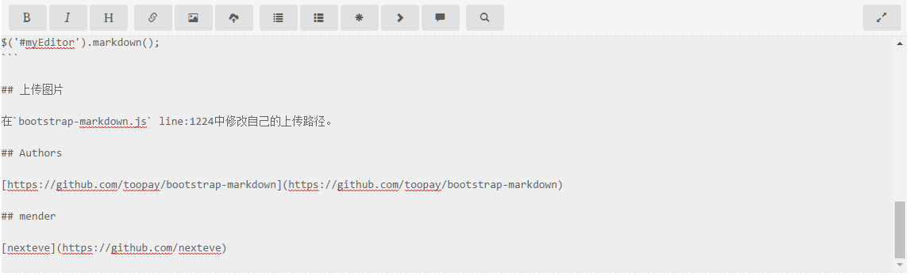
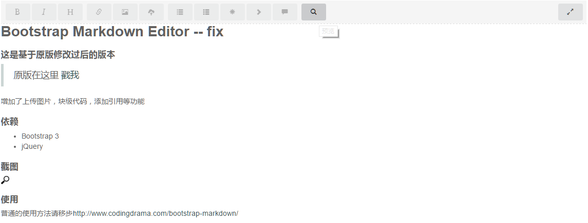

# Bootstrap Markdown Editor -- fix

## 这是基于原版修改过后的版本

> 原版在这里 [戳我](https://github.com/toopay/bootstrap-markdown)

增加了上传图片，块级代码，添加引用等功能

## 依赖

* Bootstrap 3
* jQuery

## 截图
编辑


预览


## 使用

普通的使用方法请移步[http://www.codingdrama.com/bootstrap-markdown/](http://www.codingdrama.com/bootstrap-markdown/)

```html
<link href="//cdn.bootcss.com/bootstrap/3.3.0/css/bootstrap.min.css" rel="stylesheet">
<link href="css/bootstrap-markdown.css" rel="stylesheet">
```

```html
<script src="//cdn.bootcss.com/jquery/2.1.0/jquery.min.js"></script>
<script src="//cdn.bootcss.com/bootstrap/3.3.0/js/bootstrap.min.js"></script>
<script src="js/bootstrap-markdown.js"></script>
```

```html
<textarea name="text" id="myEditor"># Test</textarea>
```

初始化编辑器:

```javascript
$('#myEditor').markdown();
```

## 上传图片

在`bootstrap-markdown.js` line:1224中修改自己的上传路径。

## Authors

[https://github.com/toopay/bootstrap-markdown](https://github.com/toopay/bootstrap-markdown)

## mender

[nexteve](https://github.com/nexteve)
